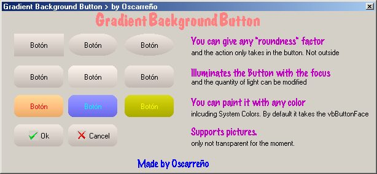



## Rounded Gradient Background Button

### Description

This is an OCX replacement for the command button. It has rounded corners fully customizable, and a gradient background, wich illuminates when the focus event is on. You can give any color you want, inluding system colors. It takes vbButtonFace color by default. When pressed the gradient inverts to give the sensation of pressed. Supports pictures. Hope you like it! (Now it has the recommendations of Rick Bull)
 
### More Info
 
nope

             |
---                |---
**Submitted On**   |2002-04-29 18:22:20
**By**             |[Oscarreno](https://github.com/Planet-Source-Code/PSCIndex/blob/master/ByAuthor/oscarreno.md)
**Level**          |Advanced
**User Rating**    |4.8 (24 globes from 5 users)
**Compatibility**  |VB 5\.0, VB 6\.0
**Category**       |[OLE/ COM/ DCOM/ Active\-X](https://github.com/Planet-Source-Code/PSCIndex/blob/master/ByCategory/ole-com-dcom-active-x__1-29.md)
**World**          |[Visual Basic](https://github.com/Planet-Source-Code/PSCIndex/blob/master/ByWorld/visual-basic.md)
**Archive File**   |[Rounded\_Gr773694292002\.zip](https://github.com/Planet-Source-Code/oscarreno-rounded-gradient-background-button__1-34210/archive/master.zip)

